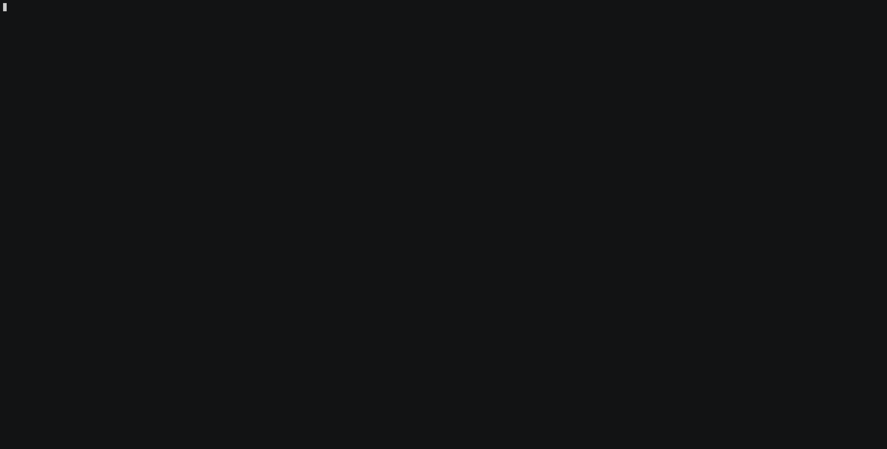

# c3 - CodeCommit CLI
`c3` is a tool which provides AWS CodeCommit functionality from the command line. This was born from working on a project which moved from Github to CodeCommit and feeling some pain with the CodeCommit console experience, alongside an interest in learning Go (and building useful, practical things is a good way to learn). 

Inspired in part by hub and the GitHub CLI. 

This is still in the very early stages of development 



## Usage 

- `c3 pr [approve, checkout, create, diff, list, merge, revoke]`
- `c3 link [filepath | pr:123]`

Note: merge will delete remote source branch unless `--delete-branch=false` is specified.

## Installation

Prebuilt binaries (macOS and Linux) from [releases page][]

### Build from source 
0. Prerequisites
* git

1. Clone the repository
```
git clone git@github.com:carthewd/c3.git
cd c3
```

2. Build the project

``` make ```

3. Move the `c3` binary somewhere in your path

``` mv c3 /usr/local/bin/ ```

OR

``` make install ```
